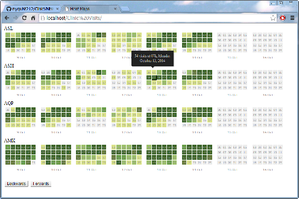

#Meditech Clinic Visit Heat Maps

A simple set of multivariate, time series heat maps using [cal-heatmaps](http://kamisama.github.io/cal-heatmap/), [d3.js](http://d3js.org) and data from the [Meditech Dirty Repository](https://www.meditech.com/ProductBriefs/pages/productpagedr.htm).

The trailing seven days of data is illustrated by day and summarized by hour of each day. 

Each cell represents an hour and the roll-over tool tip summarizes the activity for that hour.

The data source is a series of flat files (CSV) exported from the Meditech DR.

If you want to connect the visualization to a live query and feed the visualization directly from the DR, see this post -

[http://nyquist212.wordpress.com/2014/03/04/getting-json-from-ms-sql-server-2012-with-php/](http://nyquist212.wordpress.com/2014/03/04/getting-json-from-ms-sql-server-2012-with-php/)

